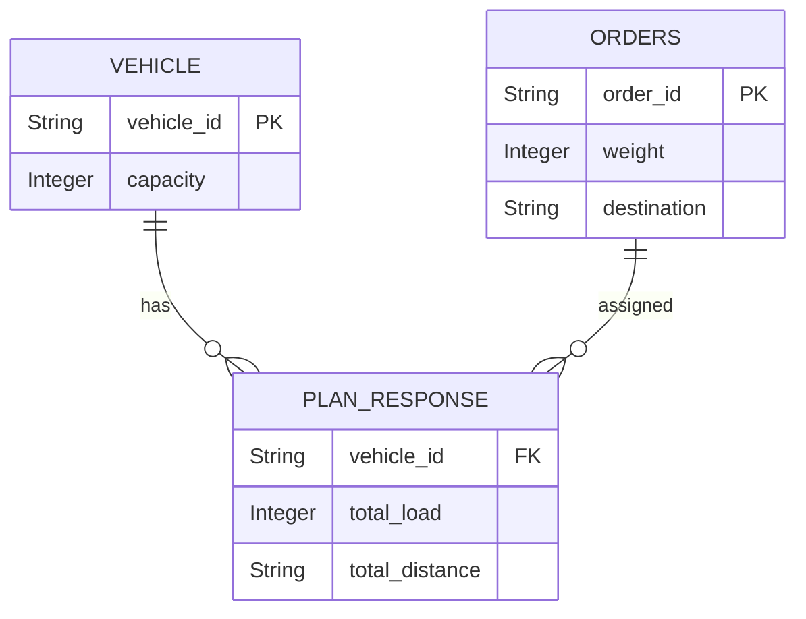

# 🚚 Load Balancer – Dispatch Planning System

This project is a **Load Balancer for Freight Dispatching**, built with **Spring Boot**.  
It optimally assigns **orders to vehicles** based on **capacity, distance, and load constraints**, while also handling **unassignable orders**.  
The system integrates with **Google Maps Directions API** for distance calculation and exposes REST APIs with **Swagger UI** documentation.

---

## ✨ Features
- Vehicle and Order management
- Load balancing logic:
  - Assigns orders to vehicles based on available capacity
  - Calculates total load & travel distance per vehicle
  - Handles **unassignable orders**
- RESTful APIs with **Swagger UI**
- In-memory **H2 database** with console support
- Modular, testable architecture with JUnit & Mockito

---

## 🛠️ Tech Stack
- **Java 17**
- **Spring Boot 3**
- **Spring Data JPA (Hibernate)**
- **H2 Database (in-memory)**
- **SpringDoc OpenAPI (Swagger UI)**
- **Google Maps Directions API** (for distance calculation)
- **JUnit 5 & Mockito** (for testing)

---

## 📂 Project Structure
```

loadbalancer/
├── src/main/java/com/freightfox/loadbalancer/
│   ├── controller/    # REST controllers
│   ├── service/       # Business logic
│   ├── repository/    # Spring Data JPA Repositories
│   ├── model/         # Entities & DTOs (Vehicle, Order, PlanResponse)
│   └── LoadBalancerApplication.java
├── src/test/java/com/freightfox/loadbalancer/  # Unit & Integration tests
├── src/main/resources/
│   ├── application.properties
│   └── data.sql (optional test data)
└── README.md

````

---

## 🗄️ Database (H2)
The project uses **in-memory H2 DB**.

**Config:** (from `application.properties`)
```properties
spring.datasource.url=jdbc:h2:mem:testdb
spring.datasource.driverClassName=org.h2.Driver
spring.datasource.username=sa
spring.datasource.password=
spring.jpa.hibernate.ddl-auto=update
spring.h2.console.enabled=true
spring.h2.console.path=/h2-console
````

👉 Access H2 Console at:
`http://localhost:8080/h2-console`
Use JDBC URL: `jdbc:h2:mem:testdb`

---

## 📖 API Documentation (Swagger)

Swagger UI is enabled via **SpringDoc**.

* API Docs (JSON): `http://localhost:8080/v3/api-docs`
* Swagger UI: `http://localhost:8080/swagger-ui.html`

---

## 📊 ERD Diagram

Below is a simplified Entity Relationship Diagram (ERD):



---

## ▶️ How to Run

### 1. Clone the repo

```bash
git clone https://github.com/your-username/loadbalancer.git
cd loadbalancer
```

### 2. Build & Run (Maven)

```bash
mvn spring-boot:run
```

---
#🌐 REST API Endpoints
🚚 Orders
➕ Create Orders

POST /api/dispatch/orders
Request Body:

{
  "orders": [
    {
      "orderId": "ORD001",
      "latitude": 12.9716,
      "longitude": 77.5946,
      "address": "MG Road, Bangalore, Karnataka, India",
      "packageWeight": 10,
      "priority": "HIGH"
    },
    {
      "orderId": "ORD002",
      "latitude": 13.0827,
      "longitude": 80.2707,
      "address": "Anna Salai, Chennai, Tamil Nadu, India",
      "packageWeight": 20,
      "priority": "MEDIUM"
    }
  ]
}


Response:

{
  "message": "Delivery orders accepted.",
  "status": "success"
}

🚛 Vehicles
➕ Register Vehicles

POST /api/dispatch/vehicles
Request Body:

{
  "vehicles": [
    {
      "vehicleId": "VEH001",
      "capacity": 100,
      "currentLatitude": 12.9716,
      "currentLongitude": 77.6413,
      "currentAddress": "Indiranagar, Bangalore, Karnataka, India"
    },
    {
      "vehicleId": "VEH002",
      "capacity": 150,
      "currentLatitude": 13.0674,
      "currentLongitude": 80.2376,
      "currentAddress": "T Nagar, Chennai, Tamil Nadu, India"
    }
  ]
}


Response:

{
  "message": "Vehicle details accepted.",
  "status": "success"
}

📦 Dispatch Plan
📋 Retrieve Dispatch Plan

GET /api/dispatch/plan

Response:

{
  "dispatchPlan": [
    {
      "vehicleId": "VEH001",
      "totalLoad": 10,
      "totalDistance": "5 km",
      "assignedOrders": [
        {
          "orderId": "ORD001",
          "latitude": 12.9716,
          "longitude": 77.5946,
          "address": "MG Road, Bangalore, Karnataka, India",
          "packageWeight": 10,
          "priority": "HIGH"
        }
      ]
    },
    {
      "vehicleId": "VEH002",
      "totalLoad": 20,
      "totalDistance": "6 km",
      "assignedOrders": [
        {
          "orderId": "ORD002",
          "latitude": 13.0827,
          "longitude": 80.2707,
          "address": "Anna Salai, Chennai, Tamil Nadu, India",
          "packageWeight": 20,
          "priority": "MEDIUM"
        }
      ]
    }
  ]
}

## ✅ Example API Responses

### Assign Orders API Response

```json
{
  "vehicleId": "V1",
  "totalLoad": 200,
  "totalDistance": "25 km",
  "assignedOrders": [
    { "orderId": "O1", "weight": 100, "destination": "Bangalore" },
    { "orderId": "O2", "weight": 100, "destination": "Mysore" }
  ]
}
```

### Unassignable Orders

```json
{
  "unassignedOrders": [
    { "orderId": "O5", "weight": 400, "destination": "Chennai" }
  ]
}
```

---

## 📌 Future Enhancements

* Integrate **real-time traffic data** with Google Maps API
* Support for multiple dispatch strategies (Greedy, Round Robin, Cost-based)
* Vehicle route optimization

```

---

👉 You can copy this directly into your `README.md`.  

Do you also want me to add **example API endpoints list** (like `/api/orders`, `/api/vehicles`, `/api/plan`) to make the README more developer-friendly?
```
